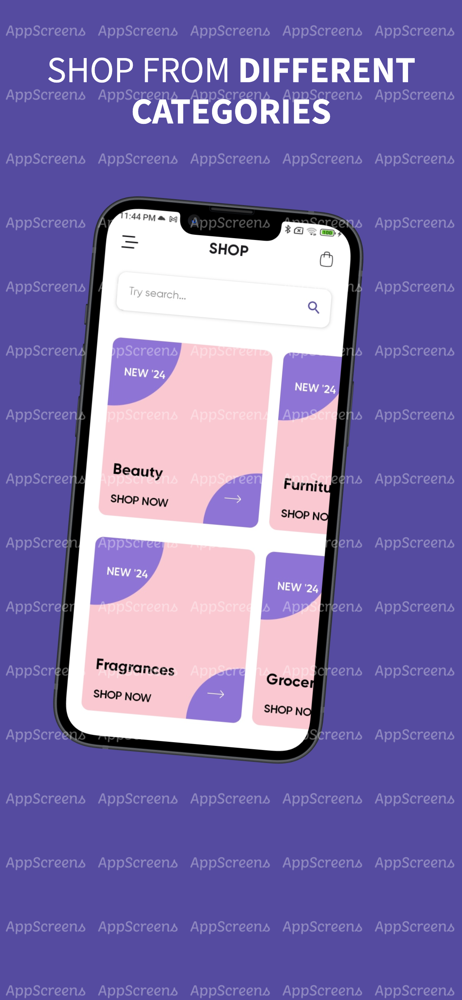
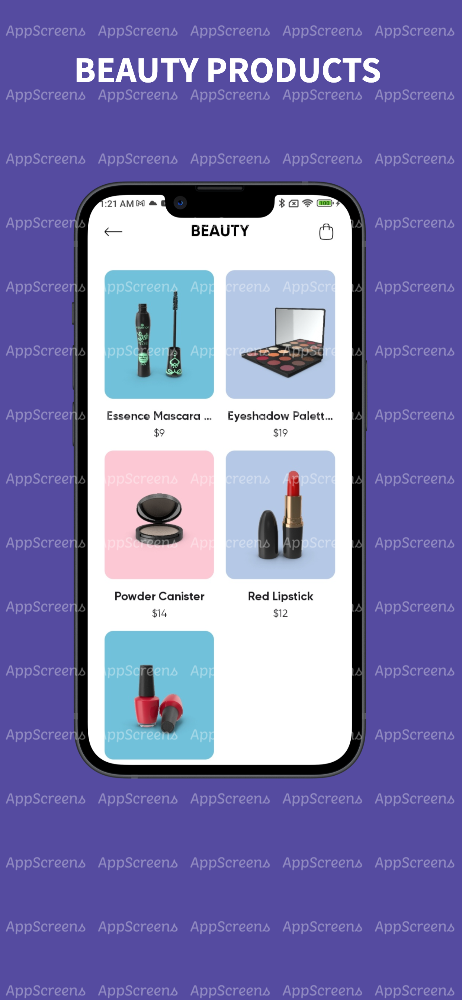
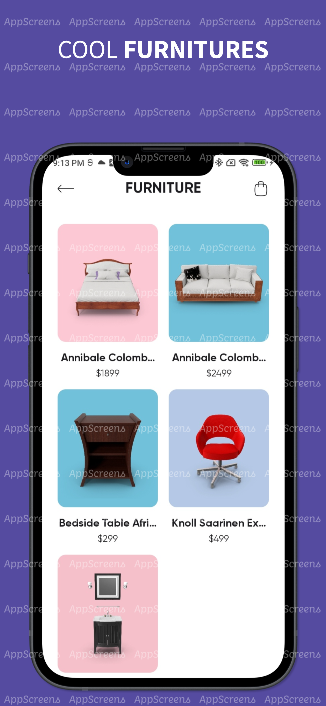
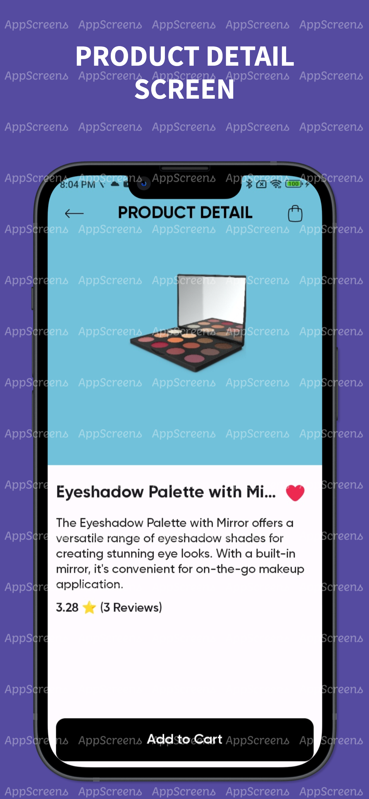
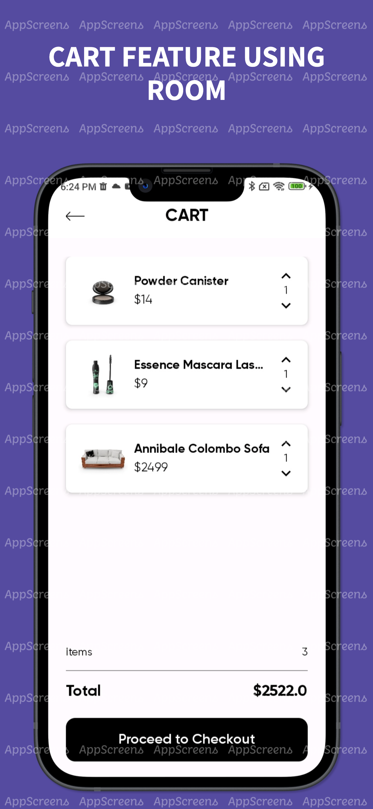

# E-commerce Android Application

## Screenshots

  
  
  
  
  

## Overview

This project is an e-commerce Android application designed to demonstrate the use of modern Android development tools and practices. It showcases the implementation of Clean Architecture with MVVM and MVI, leveraging Jetpack Compose for UI, Navigation Graph for navigation, Paging 3 for data pagination, Retrofit for network operations, Room for local database management, Hilt for dependency injection, and DataStore for data persistence.

## Tech Stack

The application is built using the following technologies:

- **Jetpack Compose**: For building the UI declaratively.
- **Navigation Graph**: For handling in-app navigation.
- **Clean Architecture with MVVM & MVI**: To separate concerns and ensure testability and maintainability.
- **Paging 3**: For handling large sets of data efficiently.
- **Retrofit**: For making network requests.
- **Room**: For local database management.
- **Hilt**: For dependency injection.
- **DataStore**: For data persistence.

## Unit Testing

Unit testing is a crucial part of this project. The primary goal is to demonstrate how to implement unit testing in a clean architecture with MVVM. We have written unit tests for the ViewModel, UseCases, and Repository layers to ensure that the business logic is working correctly and to provide a robust and maintainable codebase.

The unit tests cover:
- ViewModel logic
- UseCase interactions
- Repository methods
- Data transformation and mapping

We used libraries such as Mockk for mocking dependencies, and Turbine for testing Kotlin Flow emissions.

### Folder Structure:

- **data**: Contains the data layer implementations, including API services, database entities, data sources, and mappers.
  - **api**: API service definitions.
  - **db**: Database entities and DAO interfaces.
  - **datasource**: Data source implementations.
  - **mapper**: Data mappers to transform data between different layers.
  - **repository**: Data repository implementations.
- **domain**: Contains the business logic and domain models.
  - **model**: Domain models.
  - **repository**: Repository interfaces.
  - **usecase**: Use cases that encapsulate specific business logic.
- **presentation**: Contains the presentation layer, including ViewModels, UI components, and mappers.
  - **viewmodel**: ViewModel classes.
  - **ui**: Composable UI components and screens.
  - **mapper**: Mappers to transform domain models to UI models.
- **di**: Dependency injection setup using Hilt.
- **utils**: Utility classes and extension functions.

🚧 This project is a **work in progress (WIP)** and may not be fully functional. Some features might not work as improvements and features are being added regularly. 🚧

## Conclusion

This e-commerce application serves as a comprehensive example of modern Android development practices. It demonstrates the use of Jetpack Compose for building UIs, adheres to Clean Architecture principles, and emphasizes the importance of unit testing in creating a maintainable and scalable codebase.

## Folder Structure

The project follows a modular structure to maintain a clear separation of concerns:

